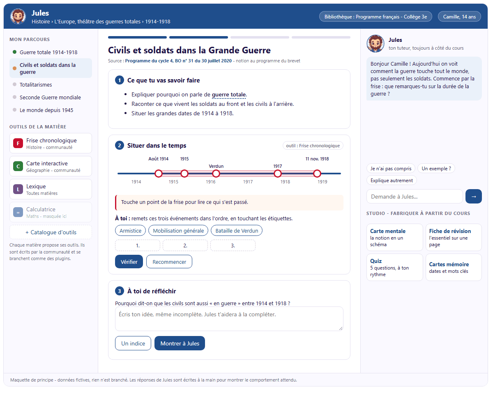

<p align="center"></p>

# Jules

**Un tuteur libre qui s'adapte à chaque élève. Il guide pas à pas et ne donne jamais la réponse.**

*Libre : chacun peut le lire, l'installer et le modifier. Gratuit avec un modèle installé sur l'ordinateur ; payant à l'usage avec un moteur en ligne, plus fiable aujourd'hui (voir [Choisir l'intelligence artificielle](#choisir-lintelligence-artificielle)).*

Jules aide un enfant à apprendre comme le ferait un bon répétiteur : il demande ce qui a déjà été essayé, découpe le problème en petites marches et laisse l'élève trouver. Il note ce qui semble bloquer et envoie chaque soir un court bilan au parent. Si l'enfant parle de harcèlement ou de mal-être, le parent est prévenu tout de suite.

Jules n'est lié à aucun niveau ni à aucune matière. C'est un **harnais** : au départ il est vide, puis il charge ce dont l'élève a besoin (le programme de sa classe, les outils de ses matières, les adaptations qui l'aident à lire ou à se concentrer) et s'enrichit ensuite de ses cours et de ses devoirs. Le même Jules peut accompagner un élève de CM1 en conjugaison et un lycéen en physique.

Le projet est ouvert à tous : parents, enseignants, orthophonistes, étudiants, développeurs. Voir [CONTRIBUTING.md](CONTRIBUTING.md).

> **Pourquoi Jules.** Jules est né d'un essai, [*Après la dernière main levée*](docs/essai/), qui se demande ce que l'intelligence artificielle fait à l'apprentissage des enfants et à quelles conditions elle peut aider au lieu de faire à leur place. Sa lecture n'est pas nécessaire pour utiliser Jules. Elle montre d'où part le projet, les études sur lesquelles il s'appuie, et une postface dit ce que Jules en a repris, ce qu'il a corrigé et ce qui lui manque encore.

> **Où en est le projet.** Jules fonctionne comme un tuteur par conversation, avec une première bibliothèque : le programme officiel de 3e. L'**interface de cours** (étape 2 de la feuille de route) est construite : une leçon en blocs au centre, le parcours de l'élève à gauche, Jules à côté qui guide sans donner la réponse ; trois leçons expérimentales (mathématiques, français, histoire) servent de premier contenu, à relire par un enseignant. Les outils par matière (étape 3) restent à concevoir ; les adaptations aux troubles dys ont leur place réservée pour plus tard : voir la [feuille de route](docs/VISION.md). C'est le bon moment pour donner son avis.

## Où va Jules

<p align="center"></p>
<p align="center"><em>Maquette de principe, rien n'est encore branché. Au centre le cours, à gauche le parcours et les outils de la matière, à droite Jules qui accompagne.</em></p>

Quatre idées guident la suite :

| Idée | Ce que ça veut dire |
|---|---|
| **Un cours, pas un chat** | L'élève suit une leçon faite de blocs : explication, frise, carte, exercice, question ouverte. Jules est à côté et voit ce que fait l'élève. Il le laisse d'abord essayer ; quand il intervient, c'est par une question, jamais par la réponse. |
| **Des bibliothèques qui se branchent** | Chaque bibliothèque (un programme officiel, un cours d'enseignant, une méthode de lecture) dit à quels niveaux et à quels âges elle s'adresse. Jules charge celles qui correspondent à l'élève. |
| **Des outils par matière** | Frise chronologique, calculatrice, géométrie, conjugueur, carte muette... Chaque outil est une petite brique écrite par la communauté, que Jules peut ouvrir au milieu d'une leçon. |
| **Une interface qui s'adapte à l'élève** | Les besoins particuliers de l'élève (troubles dys, attention, vue...) changeront l'affichage et la façon dont Jules s'exprime. Chaque trouble a ses particularités : c'est un chantier à part entière, qui sera construit plus tard avec des professionnels. Sa place est déjà réservée. |

Le détail, les étapes et les règles de sécurité des outils sont dans [docs/VISION.md](docs/VISION.md).

## Ce que fait Jules aujourd'hui

- **Interface de cours** : l'élève suit une leçon en blocs (objectifs, texte, exemple, exercice, question ouverte, synthèse) avec, à côté, Jules qui laisse essayer avant d'aider et ne donne jamais la réponse ; à gauche, le parcours des notions de la matière avec leur état estimé. La fin d'une leçon alimente le suivi et l'épreuve sans aide, comme un échange en conversation.
- **Aide aux devoirs** avec la photo de l'exercice, sans jamais donner la réponse, même si l'enfant insiste.
- **Cinq modes de conversation** : aide aux devoirs, réexplique-moi, quiz, fiche de révision, préparer un contrôle.
- **Épreuve sans aide** : quelques jours après, Jules propose de reprendre sans aide les notions marquées comprises. Ce qui a tenu devient « acquis », ce qui n'a pas tenu repasse « en cours », et le bilan du soir le dit au parent.
- **Suivi des notions** (comprise, en cours, bloquée) et **bilan du soir** pour le parent, avec une ou deux questions à poser à l'enfant, faites pour être posées sans savoir faire l'exercice (« Explique-moi comment tu sais qu'un nombre est premier »). Ce suivi est une estimation faite par l'IA à partir des conversations, pas une évaluation : il sert à savoir de quoi parler, pas à noter l'élève.
- **Vigilance** : un message inquiétant déclenche une alerte immédiate au parent, et l'enfant est orienté vers le 3018 et le 119.
- **Des notions du programme** : l'élève choisit la notion sur laquelle il travaille, ou Jules la reconnaît dans son message ou sur la photo de l'exercice. Jules reçoit alors ce que le programme attend, les repères de cours disponibles et, si un enseignant en fournit une, sa direction pédagogique (`bibliotheque/`, voir son [README](bibliotheque/README.md)).
- **Bibliothèques expérimentales** : le programme officiel de 3e (252 notions, source officielle de chacune), une fiche de repères pour chacune de ces notions dans les 12 matières, et trois premières leçons en blocs (théorème de Pythagore, accord du participe passé avec avoir, la guerre totale 1914-1918), écrites à partir de contenus libres. Elles ne sont pas validées par un enseignant : Jules le sait, et l'élève le voit. Les autres niveaux, du primaire au lycée, sont à construire.
- **Données à la maison** : conversations, photos et bilans restent sur l'ordinateur familial. Pas de compte, pas de publicité. Depuis l'espace parent, on peut télécharger tout le dossier de l'élève (.zip), effacer une conversation, ou tout effacer d'un coup.

## Ce que Jules ne sait pas encore

- **S'il fait progresser.** Jules n'a été essayé que dans une famille, sans mesure. Un tuteur bien réglé évite surtout que l'IA fasse le travail à la place de l'enfant ; les progrès mesurés dans les études viennent quand un adulte s'en mêle. Une épreuve sans aide, quelques jours après, vérifie déjà ce qui reste chez un élève ; ce n'est pas une étude.
- **Tenir la règle avec un petit modèle installé sur l'ordinateur** (voir plus bas).

## Installation

Il faut Python 3.10 ou plus récent ([python.org](https://www.python.org/downloads/)).

```bash
git clone https://github.com/alexxb2mg-svg/jules.git
cd jules
python -m venv .venv
# Windows : .venv\Scripts\activate    macOS / Linux : source .venv/bin/activate
python -m pip install -e .
jules installer
jules
```

Ouvrir ensuite <http://127.0.0.1:8795/> (page de l'élève) et <http://127.0.0.1:8795/parent> (espace parent).

Sans installation par pip, `python lancer.py <commande>` fait la même chose que `jules <commande>`.

### Choisir l'intelligence artificielle

`jules installer` pose quelques questions (prénom, genre, classe) puis propose un moteur d'IA :

| Moteur | Coût | Où vont les messages | À prévoir |
|---|---|---|---|
| **Démo** (par défaut) | gratuit | nulle part | rien : pour découvrir l'interface, Jules ne répond pas vraiment |
| **Ollama** | gratuit | restent sur l'ordinateur | [ollama.com](https://ollama.com), puis `ollama pull qwen3-vl:8b` ; un ordinateur assez récent |
| **Mistral AI** | payant à l'usage | Mistral (France) | une clé sur [console.mistral.ai](https://console.mistral.ai) |
| **Anthropic (Claude)** | payant à l'usage | Anthropic | une clé sur [console.anthropic.com](https://console.anthropic.com) |
| **OpenAI** | payant à l'usage | OpenAI | une clé sur [platform.openai.com](https://platform.openai.com) |
| **Albert** (IA publique de l'État) | gratuit pour les agents publics | serveurs de l'État, en France | réservé aux enseignants et établissements : voir plus bas |

Tout service compatible avec le format OpenAI (LM Studio, vLLM, OpenRouter...) fonctionne aussi : voir `config.local.exemple.yaml`.

> **À savoir :** les petits modèles locaux respectent moins bien la règle « ne jamais donner la réponse ». Lors de nos essais, un modèle de 8 milliards de paramètres a fini par céder quand l'élève insistait. Pour un usage quotidien, un moteur en ligne reste plus fiable. Améliorer ce point avec les modèles locaux fait partie des chantiers ouverts.

La clé API se colle dans le fichier `.env`, créé par l'assistant. Elle n'est jamais écrite ailleurs ni affichée. Avec un service payant, fixez un plafond de dépense mensuel dans sa console.

**Âge des utilisateurs.** Les conditions des fournisseurs d'IA encadrent l'usage par des mineurs : c'est l'adulte qui ouvre le compte, accepte les conditions et reste responsable de l'usage. Lisez-les avant de choisir.

### Utiliser Jules sur une tablette

1. Définir les deux codes d'accès : `jules code eleve`, puis `jules code parent`.
2. Dans `config.local.yaml`, mettre `serveur: {hote: 0.0.0.0}`.
3. Sur la tablette, reliée au même wifi, ouvrir `http://<adresse-de-l-ordinateur>:8795/`.

Jules refuse de démarrer sur le réseau tant que les deux codes ne sont pas définis. Ne l'exposez jamais sur Internet.

### Vous êtes enseignant ? Jules fonctionne avec Albert

[Albert](https://albert.sites.beta.gouv.fr/) est l'IA publique de l'État, opérée par la DINUM. Les modèles sont libres (Mistral…), hébergés en France avec la qualification SecNumCloud, et aucune conversation n'est conservée. L'accès est **gratuit pour les agents de la fonction publique d'État**, enseignants compris.

1. Demander un accès : [albert.sites.beta.gouv.fr/access](https://albert.sites.beta.gouv.fr/access/). La réponse arrive en général sous 24 heures.
2. Créer une clé dans le [Playground Albert](https://albert.playground.etalab.gouv.fr/keys).
3. Lancer `jules installer` et choisir **Albert**, puis coller la clé dans le fichier `.env` (`ALBERT_API_KEY=...`).

Jules utilise alors `openweight-medium` (Mistral Small, qui lit aussi les photos d'exercices) pour parler avec l'élève, et `openweight-small` pour les tâches de fond (suivi, bilan du soir).

Albert est réservé aux usages professionnels des agents publics : il convient à un projet de classe ou d'établissement, pas à un usage familial privé. Respectez les règles de votre académie et du [cadre d'usage de l'IA en éducation](https://www.education.gouv.fr/cadre-d-usage-de-l-ia-en-education-450647).

**Nous cherchons des enseignants** pour essayer Jules avec Albert, relire les fiches du programme et nous aider à le proposer sur la [Forge des communs numériques éducatifs](https://forge.apps.education.fr). Ouvrez un ticket [« Retour d'usage »](https://github.com/alexxb2mg-svg/jules/issues/new/choose) ou écrivez dans les [Discussions](https://github.com/alexxb2mg-svg/jules/discussions).

## Commandes

```text
jules installer            assistant : profil de l'enfant et choix du moteur d'IA
jules                      démarre le serveur
jules verifier             charge toutes les briques et affiche le prompt assemblé
jules code eleve|parent    définit un code d'accès (seule son empreinte est enregistrée)
jules rapport [AAAA-MM-JJ] affiche le bilan d'un jour, sans l'envoyer
```

## Comment c'est construit

Tout se branche par la configuration, sans toucher au cœur :

| Brique | Où | Rôle | État |
|---|---|---|---|
| Persona | `persona/<id>/` | La personnalité : nom, ton, couleurs, avatar, en fichiers texte | en place |
| Profil | `profils/<id>.yaml` | Ce que Jules sait de l'élève. Seul `exemple.yaml` est publié | en place |
| Consignes | `consignes/*.md` | Pédagogie, sécurité, format : communes à toutes les personas | en place |
| Modes | `consignes/modes/*.md` | Un fichier = un bouton sur la page de l'élève | en place |
| Modules | `jules/modules/<id>.py` | Mémoire, suivi, vigilance, bilan du soir, module `cours` (interface de leçon) | en place |
| Notifieurs | `jules/notifieurs/<id>.py` | Canaux vers le parent : fichier, Telegram | en place |
| Moteurs d'IA | `jules/llm/<id>.py` | demo, openai_compatible, anthropic | en place |
| Bibliothèques | `bibliotheque/<id>/` | Référentiel des notions, fiches par notion, leçons en blocs, direction d'un enseignant ; chargées selon le niveau de l'élève, par ordre de priorité | en place, contenus expérimentaux (3e) |
| Outils | à définir | Frise, calculatrice, carte... ouverts par Jules pendant une leçon | à concevoir |
| Adaptations | `adaptations/` | Besoins particuliers (troubles dys, attention...) : affichage et consignes adaptés | emplacement réservé |

Les textes s'accordent selon le genre indiqué dans le profil (fille, garçon ou neutre) : `{{elle|il|iel}}` dans un fichier de consignes donne la bonne forme. Les variables `{prenom}`, `{classe}` et `{parent}` viennent aussi du profil.

Les consignes de sécurité sont toujours placées en dernier dans le prompt : elles passent avant la persona et le mode choisi.

## Configuration

| Fichier | Contenu | Publié ? |
|---|---|---|
| `config.yaml` | réglages communs, sûrs par défaut | oui |
| `config.local.yaml` | réglages de la famille : profil, codes, moteur, accès tablette | **jamais** |
| `.env` | clés API | **jamais** |
| `profils/<prenom>.yaml` | profil réel de l'enfant | **jamais** |
| `donnees/` | conversations, photos, bilans | **jamais** |

Des tests et un contrôle au moment du commit empêchent ces fichiers privés d'entrer dans le dépôt.

## Vie privée et sécurité

- Rien ne sort de l'ordinateur, sauf les messages envoyés au moteur d'IA choisi (aucun avec Démo ou Ollama).
- Les codes d'accès sont stockés sous forme d'empreinte salée (scrypt), jamais en clair.
- Les pages web refusent tout script ou style venu d'ailleurs (Content-Security-Policy).
- Les photos sont vérifiées (vraie image, 8 Mo au plus) avant d'être enregistrées.
- Les futurs outils de la communauté tourneront dans un espace isolé, sans accès au réseau ni aux données de l'élève, et passeront une validation encadrée avant d'être proposés : voir [docs/VISION.md](docs/VISION.md#4-la-sécurité-des-outils).

Signaler une faille : voir [SECURITY.md](SECURITY.md).

## Contribuer

Bibliothèques pour d'autres niveaux (primaire, collège, lycée), fiches de cours, outils pour une matière, réflexion sur les adaptations aux troubles dys, nouvelles personas, relecture pédagogique, tests avec de vrais élèves : toutes les aides comptent. Pas besoin de savoir coder pour écrire une fiche ou décrire un outil. Le guide est dans [CONTRIBUTING.md](CONTRIBUTING.md), le code de conduite dans [CODE_OF_CONDUCT.md](CODE_OF_CONDUCT.md).

## Licence

Code : [MIT](LICENSE). Essai : [CC BY-NC-ND 4.0](docs/essai/LICENCE.md). Le nom rend hommage à Jules Ferry et à l'école gratuite pour tous.
